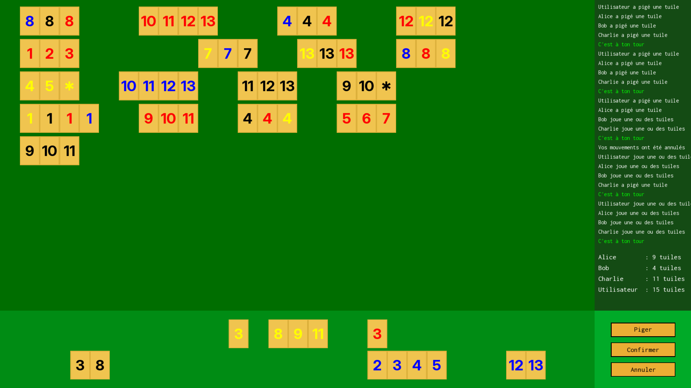

# Tile Rummy 2D

This is a project I made in college as a final integrative project for my program.
It is a 2D game made with SFML in C++ and it's played against the computer.

Here is a preview of what it look like :

It is all in French for the moments, but if I see some interest from the general public I will translate the UI and comments in the source code.

I made this public repo so I can show my project to others, as well as to offer a way of installation for people interested in trying the game.

## Installation instructions

*Soon...*

## Game rules

Rummy2D is a tile-based game inspired by classic Rummy mechanics. The goal is to form valid sets and runs using numbered tiles.

**Basic Rules**

- A set consists of three or four tiles of the same number but in different colors.
  - Example: 🔵7, 🔴7, 🟡7 (valid set)

- A run consists of three or more consecutive numbers of the same color.
    - Example: 🔵5, 🔵6, 🔵7 (valid run)

- Each player starts with a certain number of tiles and takes turns adding to the board.

- Players can rearrange existing tiles on the board to create new valid combinations.

- The first player to place all their tiles wins.

For more details on general Rummy-style tile games, see the [rummikub wikipedia](https://en.wikipedia.org/wiki/Rummikub).

## License
This project is licensed under the GNU General Public License v3.0 (GPL-3.0).
You are free to use, modify, and distribute this software as long as any derivative work is also licensed under GPL-3.0.
